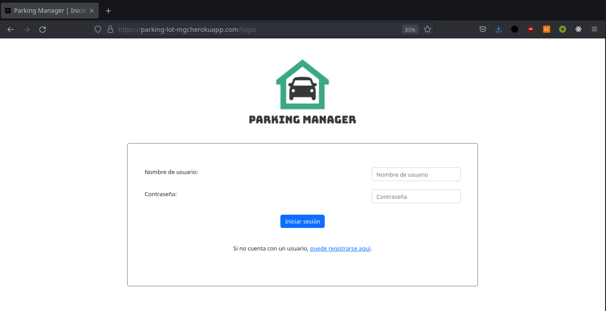
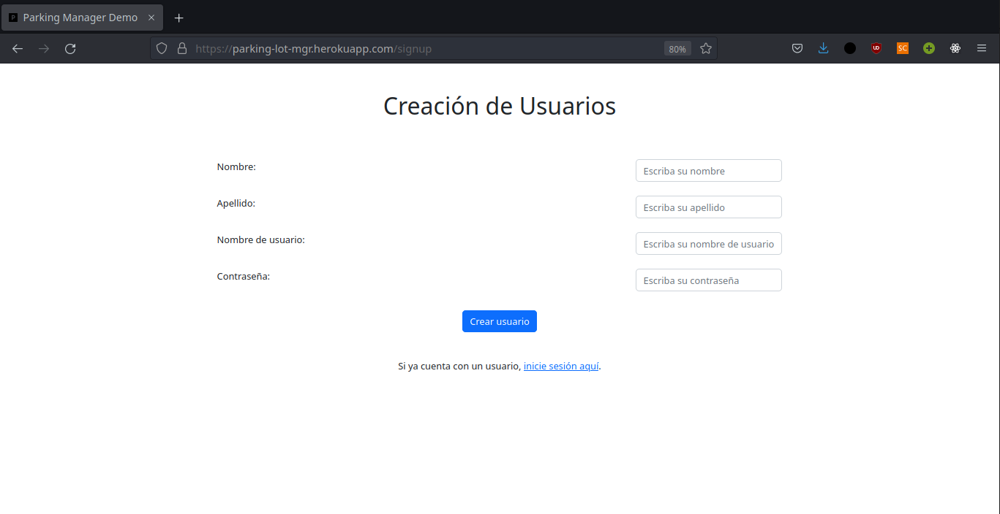
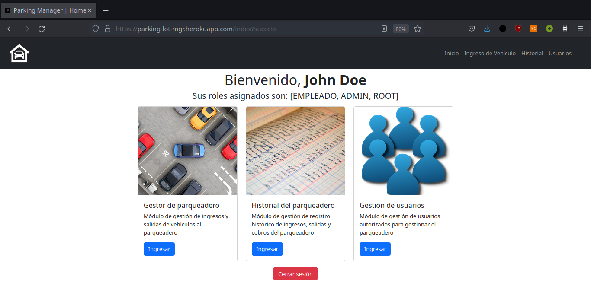
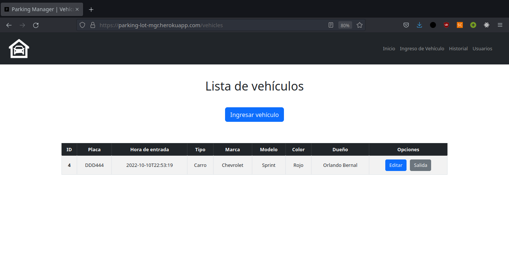
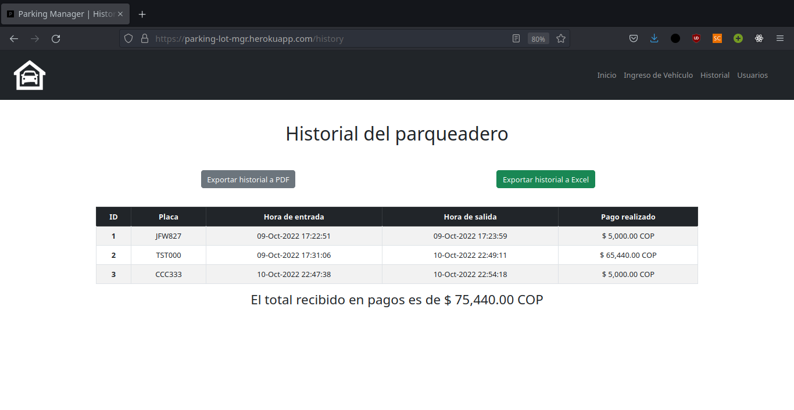
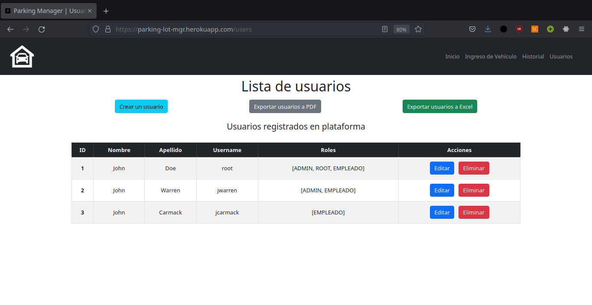

# PARKING LOT MANAGER

### Video Demo: https://youtu.be/DjocYYkyC_I

 

## Parking Lot Manager: un gestor de parqueadero digital
***
Parking Lot Manager provee un espacio para los usuarios que realizan la gestión del parqueadero, en un intento por centralizar y digitalizar la misma para el uso real. Desde la creación de usuarios hasta la generación de reportes, Parking Lot Manager busca centralizar y aportar a la gestión generalizada de un parqueadero

 

## ¿Cómo acceder?
***
Parking Lot Manager está hosteada en Heroku y puede ser accedida a través de [esta dirección](https://parking-lot-mgr.herokuapp.com/login)

 

## Convertirse en usuario

### Usuario inicial
***
1. Ir a la sección de [**_registro_**](https://parking-lot-mgr.herokuapp.com/signup)
2. Ingresar un nombre
3. Ingresar un apellido
4. Ingresar un nombre de usuario
5. Ingresar una contraseña
6. [Iniciar sesión](https://parking-lot-mgr.herokuapp.com/login) en la aplicación

_Opcional: Los roles del usuario pueden ser modificados por el usuario *root*. El usuario tiene rol *empleado* de forma predeterminada._

 

## Capturas de pantalla de la aplicación

### Inicio de sesión
***

    

 

### Registro
***

    

 

### Homepage Root
***

    

 

### Gestor de vehículos
***

    

 

### Gestor de historial
***

    

 

### Gestor de usuarios
***

    

